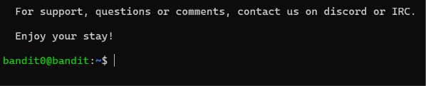
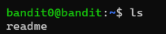
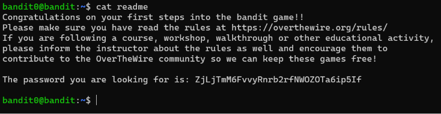

### Main Goal:
1. The goal of this level is to log into the game using SSH.
---
<h6>'SSH' Stands for Secure Shell, It is a cryptographic network protocol for operating network services securely over an unsecured network.</h6>
Syntax:
`SSH username@Hostname [Options]`

Click [https://en.wikipedia.org/wiki/Secure_Shell](https://en.wikipedia.org/wiki/Secure_Shell) | To learn more about Secure Shell.

---

### Prerequisites:
1. you should know how to open a software and know how to type

---
### Solution:
Given informaton:
1. Username: `bandit0`
2. Password: `bandit0`

#### Step-by-Step Solution:
1. Open your Command Prompt
2. Enter the following command and press Enter: 
    `ssh bandit0@bandit.labs.overthewire.org -p 2220`
3. Enter the Given Username and Password:

if You will see something like this then you have successfully completed level0 

4. Use `ls` command to view the list of data.

4. Now use `cat readme` to view the password for level1 

Copy the password to log into Level1 
